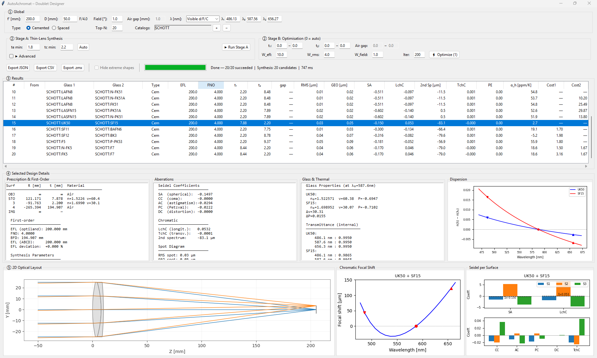
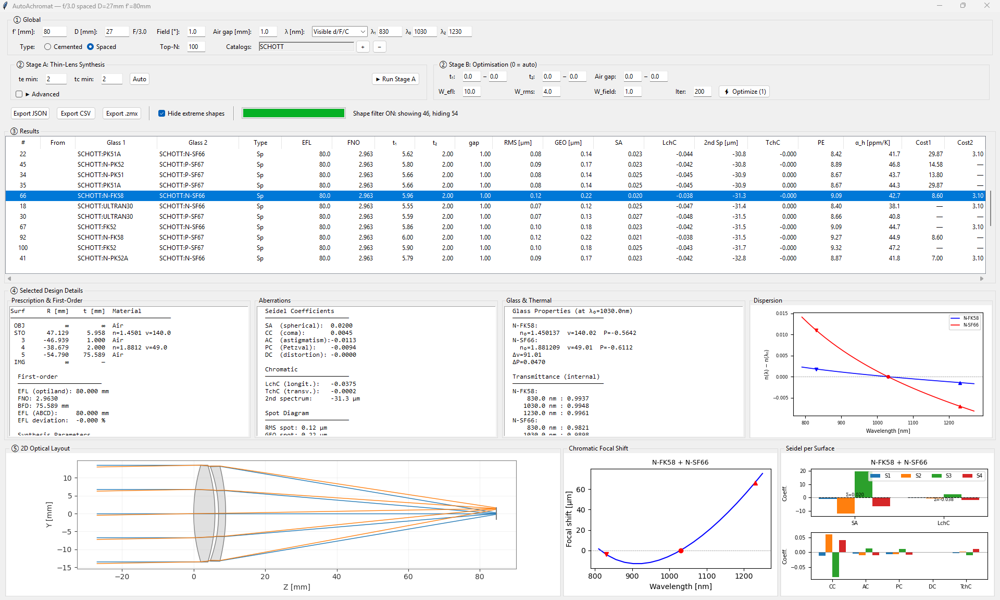

# AutoAchromat

Automated achromatic doublet lens designer. Generates cemented and air-spaced doublet initial structures from glass catalogs, evaluates optical performance via ray tracing, and exports designs for further optimization in Zemax or other optical design software.

**Cemented Doublet**



**Air-Spaced Doublet**



## What It Does

1. Reads industry-standard AGF glass catalogs (SCHOTT, OHARA, CDGM, etc.)
2. Automatically searches all valid glass pair combinations
3. Supports user-defined aberration targets (spherical aberration, coma, chromatic) via Advanced settings
4. Produces thick-lens prescriptions with manufacturing-feasible thicknesses
5. Evaluates each design: spot size, Seidel aberrations, chromatic errors, secondary spectrum, thermal stability
6. Optionally refines designs via built-in numerical optimizer (optiland, experimental)
7. Exports the best candidates as `.zmx` (Zemax), JSON, or CSV

## Installation

```bash
git clone <repo-url>
cd AutoAchromat
pip install -e .
```

Requires Python >= 3.10. Dependencies (`numpy`, `optiland`, `scipy`, `matplotlib`) are installed automatically.

## Quick Start

```bash
python -m autoachromat.gui
```

### Step 1: Set Parameters

In the Global panel, configure:
- **f', D** — focal length and aperture (F/# displayed automatically)
- **Wavelengths** — select from presets (Visible, NIR, SWIR, MWIR, LWIR) or enter manually in nm
- **Field angle** — used for off-axis aberration evaluation in Stage A and as an optimization target in Stage B
- **Air gap** — fixed during Stage A synthesis, becomes a free variable in Stage B (spaced doublets only)
- **Catalogs** — load one or more AGF glass catalog files

### Step 2: Run Stage A

The system automatically sets minimum edge/center thicknesses (te min, tc min) based on the aperture diameter according to standard manufacturing tables. You can override these values for specific manufacturing requirements, or click **Auto** to reset to the recommended defaults.

Click **Advanced** to set custom aberration targets (SA, Coma, LCA — default 0 = fully corrected) and screening thresholds (minimum Abbe number difference, maximum PE).

Click **Run Stage A** to search all glass pair combinations. Results appear in a sortable table ranked by aberration performance.

For air-spaced doublets, check **Hide extreme shapes** to filter out meniscus designs with the convex surface facing the air gap, which are difficult to manufacture and mount.

### Step 3: Analyze Results

Select any row to see:
- Prescription & first-order data
- Seidel aberration coefficients
- Glass properties, transmittance, and thermal analysis
- 2D optical layout drawing
- Chromatic focal shift curve
- Per-surface Seidel bar chart
- Dispersion comparison of the two glasses

### Step 4: Optimize (Stage B, experimental)

Select one or more rows in the results table and click **Optimize**. This runs a numerical optimizer (optiland LeastSquares) that refines radii, thicknesses, and air gap to minimize spot size while preserving focal length.

> **Note:** Stage B is slow (~10-30s per candidate) and still experimental. Merit function weights (W_efl, W_rms, W_field) and iteration count can be adjusted in the Stage B panel.

### Step 5: Export

- **Export .zmx** — export selected design to Zemax for further optimization
- **Export JSON / CSV** — export full results table

## Glass Catalogs

The repo includes OHARA and CDGM catalogs in `data/catalogs/`. To add Schott glasses, copy `SCHOTT.AGF` from your Zemax installation to `data/catalogs/`.

## Running Tests

```bash
pytest
```
