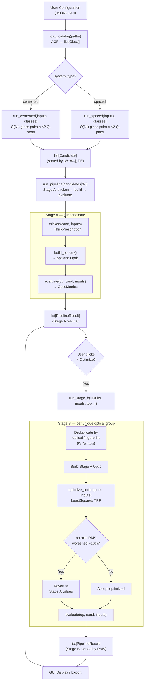
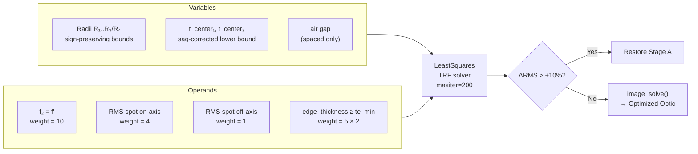
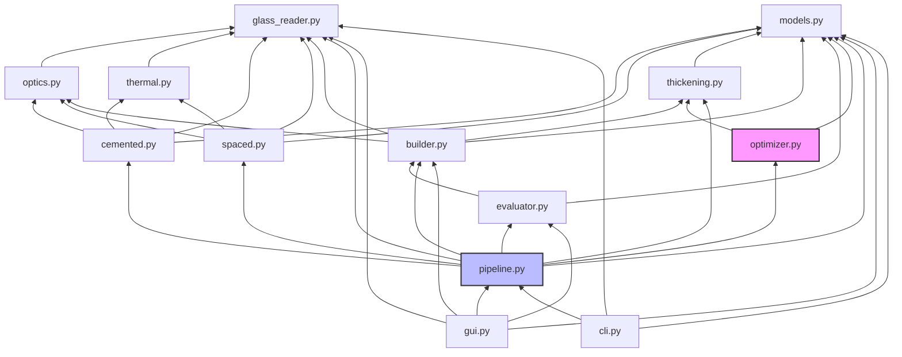

# AutoAchromat — Comprehensive Code Review Report

> Generated: 2026-03-16
> Based on line-by-line reading of all source files; all formulas cross-checked against the actual code.
> Updated to include Stage B thick-lens optimization (merged 2026-03-14).

---

## Table of Contents

1. [Project Overview and Design Goals](#1-project-overview-and-design-goals)
2. [Repository Directory Structure](#2-repository-directory-structure)
3. [Mathematical Background and Physical Foundations](#3-mathematical-background-and-physical-foundations)
4. [Module Details](#4-module-details)
5. [Data Flow and Call Chain](#5-data-flow-and-call-chain)
6. [Test Coverage](#6-test-coverage)
7. [Module Dependency Relationships](#7-module-dependency-relationships)
8. [Design Decisions and Review Points](#8-design-decisions-and-review-points)
9. [Stage B: Thick-Lens Optimization](#9-stage-b-thick-lens-optimization)
10. [Architectural Degeneracy Analysis](#10-architectural-degeneracy-analysis)
11. [Implications for Opto-Mechanical-Thermal Co-Design](#11-implications-for-opto-mechanical-thermal-co-design)
12. [Comparison with Reference Works and Proposed Directions](#12-comparison-with-reference-works-and-proposed-directions)
13. [References](#13-references)

---

## 1. Project Overview and Design Goals

**AutoAchromat** is an automated achromatic doublet lens design system developed for master's thesis research.

### Functional Goals

1. Read industrial glass catalogs (AGF format, supporting SCHOTT / OHARA / CDGM)
2. Enumerate all glass pairs and identify achromatic doublet solutions via thin-lens Seidel aberration theory
3. Convert thin-lens solutions into manufacturable thick-lens prescriptions
4. Evaluate actual optical performance through the optiland ray tracing engine
5. Perform first-order thermal analysis (passive athermalization) for each design
6. Present results via CLI / Tkinter GUI

### Design Philosophy

| Principle | Implementation |
|-----------|---------------|
| Separation of pure math and optics | `thickening.py` has no external dependencies, only the Python standard library |
| Defensive programming | All functions return `None` on failure; exceptions are not propagated upward |
| Separation of concerns | Data structures, optical synthesis, thickening, and ray tracing are each independent modules |
| Testability | Unit tests + contract tests + integration tests |

---

## 2. Repository Directory Structure

```
c:\MasterThesis\AutoAchromat\
├── README.md
├── pyproject.toml              # Python project configuration
├── pytest.ini
├── environment.yml             # Conda environment (Python 3.11, autoachromat env)
├── requirements.txt            # Pinned dependencies
├── config_example.json         # Example configuration file
├── results.json                # Historical output (committed to git)
├── data/
│   └── catalogs/
│       ├── SCHOTT.AGF          # ~480 KB
│       ├── OHARA.agf           # ~691 KB
│       └── CDGM.AGF            # ~621 KB
├── reference paper/            # Reference literature
├── scripts/
│   └── smoke_test_bridge.py    # End-to-end integration test script
├── src/
│   └── autoachromat/
│       ├── __init__.py         # Public API exports
│       ├── models.py           # Dataclasses (162 lines)
│       ├── optics.py           # Thin-lens and aberration mathematics (251 lines)
│       ├── glass_reader.py     # AGF file parsing (316 lines)
│       ├── cemented.py         # Cemented doublet synthesis (198 lines)
│       ├── spaced.py           # Air-spaced doublet synthesis (314 lines)
│       ├── thickening.py       # Thin→thick conversion (665 lines)
│       ├── thermal.py          # Thermal analysis (257 lines)
│       ├── pipeline.py         # Pipeline coordination (280 lines)
│       ├── cli.py              # Command-line interface
│       ├── gui.py              # Tkinter desktop GUI (~1,000 lines)
│       └── optiland_bridge/
│           ├── __init__.py     # Module exports
│           ├── builder.py      # Thick prescription → optiland Optic (~315 lines)
│           └── evaluator.py    # Optical metric extraction (~341 lines)
└── tests/
    ├── test_contracts.py       # API contract tests
    ├── test_refactoring.py     # Refactoring integrity tests
    ├── test_thermal.py         # Thermal analysis tests
    └── test_thickness.py       # Thick-lens calculation tests
```

---

## 3. Mathematical Background and Physical Foundations

### 3.1 Three-Color Design Wavelengths (Fraunhofer Spectral Lines)

The code uses three standard Fraunhofer lines as design wavelengths:

$$\lambda_0 = 0.58756\ \mu\text{m} \quad \text{(d-line, yellow, primary design wavelength)}$$

$$\lambda_1 = 0.48613\ \mu\text{m} \quad \text{(F-line, blue, short wavelength)}$$

$$\lambda_2 = 0.65627\ \mu\text{m} \quad \text{(C-line, red, long wavelength)}$$

These are defined in `optics.py:13–15` and used as defaults. The user may specify any three wavelengths (e.g. for IR designs).

---

### 3.2 Refractive Index Dispersion Formulas (AGF Formats)

The Zemax AGF format uses a `formula_id` integer to identify which dispersion equation applies. The code implements 8 distinct formulas in `optics.py:53–119`:

| formula_id | Name | Formula |
|:---:|---|---|
| 1 | Schott | $n^2 = A_0 + A_1\lambda^2 + A_2\lambda^{-2} + A_3\lambda^{-4} + A_4\lambda^{-6} + A_5\lambda^{-8}$ |
| 2 | Sellmeier 1 | $n^2 = 1 + \dfrac{K_1\lambda^2}{\lambda^2-L_1} + \dfrac{K_2\lambda^2}{\lambda^2-L_2} + \dfrac{K_3\lambda^2}{\lambda^2-L_3}$ |
| 3 | Herzberger | $L = \dfrac{1}{\lambda^2 - 0.028}$,  $n = A_0 + A_1 L + A_2 L^2 + A_3\lambda^2 + A_4\lambda^4\ [+A_5\lambda^6]$ |
| 4 | Sellmeier 2 | $n^2 = 1 + A + \dfrac{B\lambda^2}{\lambda^2 - C} + \dfrac{D\lambda^2}{\lambda^2 - E}$ |
| 5 | Conrady | $n = A_0 + A_1/\lambda + A_2/\lambda^{3.5}$ |
| 6 | Sellmeier 3 | Sellmeier 1 extended with optional 4th term: $+\dfrac{K_4\lambda^2}{\lambda^2-L_4}$ |
| 7, 8 | Handbook 1 & 2 | $n^2 = 1 + A_0 + \dfrac{A_1}{\lambda^2-A_2} + \dfrac{A_3}{\lambda^2-A_4}\ [+A_5\lambda^2]$ |
| 9–12 | (Unknown) | ⚠️ Falls back to Sellmeier 1 coefficient layout silently |

**Physical note**: All dispersion formulas fit empirical data from prism or interferometric measurements. The Sellmeier form has physical motivation: each pole $(L_i)$ corresponds to a UV or IR resonance absorption band in the glass. The Schott polynomial is purely empirical with no resonance interpretation.

> **Review Point — Silent Fallback**: `optics.py:111–119`: `formula_id` 9–12 all fall into the `else` branch and are computed using Sellmeier 1 coefficient layout. If the actual AGF encoding for these IDs differs, **silently incorrect refractive indices will be returned without any error or warning**.

---

### 3.3 Abbe Number (Dispersion Measure)

The Abbe number quantifies the dispersion of a glass, defined as the ratio of refractivity to mean dispersion:

$$\nu = \frac{n(\lambda_0) - 1}{n(\lambda_1) - n(\lambda_2)}$$

- **Physical meaning**: High $\nu$ (e.g. crown glass, $\nu > 50$) → low dispersion; low $\nu$ (e.g. flint glass, $\nu < 35$) → high dispersion.
- A large $|\nu_1 - \nu_2|$ between two glasses means the achromatic correction is achieved with milder (less curved) elements, reducing higher-order aberrations.
- Code returns $\infty$ when denominator $< 10^{-10}$ (non-dispersive glass; physically unlikely in practice).
- `optics.py:127–144`

---

### 3.4 Achromatic Condition and Normalized Power Split

**Physical principle**: In a thin doublet, longitudinal chromatic aberration (axial color) arises because the focal length depends on wavelength. For the doublet to bring wavelengths $\lambda_1$ and $\lambda_2$ to the same focus, the sum of chromatic power contributions from each element must vanish:

$$\frac{\varphi_1}{\nu_1} + \frac{\varphi_2}{\nu_2} = 0 \quad (\text{standard achromatic condition, }C_0 = 0)$$

The code implements a **generalized** form (`optics.py:186–197`):

$$\varphi_1 = \frac{\nu_1(1 - \nu_2 C_0)}{\nu_1 - \nu_2}, \qquad \varphi_2 = 1 - \varphi_1$$

- When $C_0 = 0$: reduces to the standard achromatic condition.
- Always satisfies $\varphi_1 + \varphi_2 = 1$ (normalized to total system power = 1, scaled by $1/f'$).
- The normalization means $\phi_i$ is the fractional contribution of element $i$ to the total system power; actual element power = $\phi_i / f'$.
- A denominator guard $|\nu_1 - \nu_2| < 10^{-15}$ raises `ZeroDivisionError` (physically: two identical glasses cannot form an achromat).

> **Note**: When $C_0 \neq 0$, the generalized achromatic condition becomes $\varphi_1/\nu_1 + \varphi_2/\nu_2 = C_0/(\nu_1\nu_2)$. The physical interpretation of $C_0$ as a residual chromatic target should be confirmed against the reference literature.

---

### 3.5 Shape Parameter Q and Seidel Aberration Theory

#### Background: Seidel Third-Order Aberrations

Geometrical optics describes image quality through **Seidel (third-order) aberrations**: spherical aberration ($S_I$), coma ($S_{II}$), astigmatism ($S_{III}$), field curvature ($S_{IV}$), and distortion ($S_V$). These arise from the $\sin\theta \approx \theta - \theta^3/6$ approximation failure.

For a thin lens, all five Seidel sums can be expressed analytically in terms of:
- The element power $\varphi$, refractive index $n$, and Abbe number $\nu$ (fixed by glass choice and achromatic condition)
- The **shape parameter** $Q$ (free design variable — controls bending of the lens)

The shape parameter $Q$ used in this code is related to the marginal-ray angle contribution and parameterizes the bending of the lens while preserving its power. Changing $Q$ redistributes the refraction between the front and back surfaces without changing the total power.

#### Definition of Q (cemented doublet)

$Q$ is defined as the **normalized curvature of the shared cemented surface** offset by the element's normalized power. Inverting the radius formula $R_2 = f'/(\varphi_1 + Q)$ (`cemented.py:61`):

$$\boxed{Q \;\equiv\; \frac{f'}{R_2} - \varphi_1}$$

Equivalently, from the front-surface formula $R_1 = f' / \!\left(\tfrac{n_1}{n_1-1}\varphi_1 + Q\right)$:

$$Q = \frac{f'}{R_1} - \frac{n_1}{n_1-1}\,\varphi_1$$

Both expressions define the same $Q$; the identity follows from the thin-lens power constraint $(n_1-1)(c_1-c_2)f' = \varphi_1$.

**Relation to the standard Coddington shape factor** $X_1 = (c_1+c_2)/(c_1-c_2)$:

$$X_1 = (2n_1-1) + \frac{2(n_1-1)}{\varphi_1}\,Q \qquad \Longleftrightarrow \qquad Q = \frac{(X_1 - (2n_1-1))\,\varphi_1}{2(n_1-1)}$$

$Q = 0$ places the cemented surface at $R_2 = f'/\varphi_1 = f_1$ (back surface radius equals element focal length). A positive $Q$ increases both $c_1$ and $c_2$ equally (more strongly bent), while negative $Q$ flattens the element.

#### Definition of Q1, Q2 (spaced doublet)

For the air-spaced doublet, each element has an independent shape parameter normalized to its own focal length $f_i = f'/\varphi_i$. Inverting $R_2 = f_1/(1+Q_1)$ and $R_4 = f_2/(1+Q_2)$ (`spaced.py:144–147`):

$$\boxed{Q_1 \;\equiv\; \frac{f_1}{R_2} - 1 \;=\; \frac{f'}{\varphi_1 R_2} - 1}$$

$$\boxed{Q_2 \;\equiv\; \frac{f_2}{R_4} - 1 \;=\; \frac{f'}{\varphi_2 R_4} - 1}$$

Equivalently, from the front surfaces:

$$Q_1 = \frac{f_1}{R_1} - \frac{n_1}{n_1-1}, \qquad Q_2 = \frac{f_2}{R_3} - \frac{n_2}{n_2-1}$$

**Relation to the Coddington shape factor** for each element (each normalized to unit power $\varphi_i = 1$ in its own focal-length units):

$$X_i = (2n_i-1) + 2(n_i-1)\,Q_i \qquad \Longleftrightarrow \qquad Q_i = \frac{X_i - (2n_i-1)}{2(n_i-1)}$$

$Q_i = 0$ places the back surface of element $i$ at $R_\text{back} = f_i$ (equiconvex-like for a positive element). The two parameters $Q_1$ and $Q_2$ are searched jointly on the coma-zero constraint line.

---

### 3.6 Cemented Doublet Seidel Theory (`cemented.py`)

For a cemented doublet with glass 1 (index $n_1$, normalized power $\varphi_1$) cemented to glass 2 (index $n_2$, normalized power $\varphi_2 = 1 - \varphi_1$):

#### Spherical Aberration Minimization

The total normalized spherical aberration is a quadratic in $Q$:

$$A Q^2 + B Q + (C - P_0) = 0$$

with coefficients (`cemented.py:23–41`):

$$A = \left(1 + \frac{2}{n_1}\right)\varphi_1 + \left(1 + \frac{2}{n_2}\right)\varphi_2$$

$$B = \frac{3}{n_1-1}\varphi_1^2 - \frac{3}{n_2-1}\varphi_2^2 - 2\varphi_2$$

$$C = \frac{n_1}{(n_1-1)^2}\varphi_1^3 + \frac{n_2}{(n_2-1)^2}\varphi_2^3 + \left(\frac{1}{n_2-1}+1\right)\varphi_2^2$$

Setting $P_0 = 0$ (default): solve for the $Q$ values that minimize spherical aberration. The quadratic has **up to two real roots** (two bending solutions), solved via the standard formula `cemented.py:37–41`.

#### Coma Coefficient

The normalized coma has a **linear** dependence on $Q$ (`cemented.py:44–50`):

$$W = K Q + L, \qquad K = \frac{A+1}{2}, \qquad L = \frac{B - \varphi_2}{3}$$

**Physical meaning**: $W = 0$ means the design has zero third-order coma. The code's primary sort metric is $|W - W_0|$ where $W_0 = 0$ (default), selecting the bending closest to the aplanatic (coma-free) condition.

#### Three Surface Radii

Given $Q$ and $\varphi_1$, the three physical radii are (`cemented.py:53–69`; these are the inverse of the definition in §3.5):

$$R_1 = \frac{f'}{\dfrac{n_1}{n_1-1}\varphi_1 + Q}, \quad R_2 = \frac{f'}{\varphi_1 + Q}, \quad R_3 = \frac{f'}{\dfrac{n_2}{n_2-1}\varphi_1 + Q - \dfrac{1}{n_2-1}}$$

> **Code comment**: These formulas are labeled "Your spec" — they were custom-derived by the author, not lifted from a standard reference. The derivation should be cross-checked against the thesis appendix or reference literature.

#### PE Penalty Function

The PE penalty function combines the coma-induced astigmatism contribution at the cemented interface ($P_2$) with a coma sensitivity factor (`cemented.py:72–92`):

First, compute marginal-ray slopes at the cemented interface:

$$u_2 = Q\!\left(1 - \frac{1}{n_1}\right) + \varphi_1, \qquad u_3 = Q\!\left(1 - \frac{1}{n_2}\right) + \varphi_1$$

Seidel contribution from the cemented surface:

$$P_2 = \left(\frac{u_3 - u_2}{1/n_2 - 1/n_1}\right)^2 \cdot \left(\frac{u_3}{n_2} - \frac{u_2}{n_1}\right)$$

PE penalty (including coma sensitivity factor):

$$PE = \frac{|P_2| \cdot 3^{|W - W_0|}}{R_2^2}$$

> **Review Point — Exponential Factor**: The $3^{|W-W_0|}$ term is a custom penalty multiplier: when the design is far from the desired coma target $W_0$, PE is amplified exponentially ($3^1=3$, $3^2=9$, $3^3=27$). The literature basis for this specific form should be confirmed. The PE > `max_PE` filter uses this to reject candidates with excessive coma deviation.

#### Candidate Selection: Top-N Heap

- Candidates are accumulated into a list of size $N$ using a max-heap strategy.
- **Primary sort key**: $|W - W_0|$ (minimize coma deviation).
- **Secondary sort key**: $PE$ (minimize aberration penalty).
- Result: exactly top-$N$ candidates with best coma balance.

---

### 3.7 Air-Spaced Doublet Seidel Theory (`spaced.py`)

For an air-spaced doublet with two separate elements (4 surfaces), both shape parameters $Q_1$ and $Q_2$ are free. The system Seidel equations become a coupled 2D problem.

#### Seidel Coefficient Dictionary (`spaced.py:41–64`)

$$A_1 = \varphi_1^3\!\left(1 + \frac{2}{n_1}\right), \qquad B_1 = \varphi_1^3 \cdot \frac{3}{n_1-1}$$

$$A_2 = \varphi_2^3\!\left(1 + \frac{2}{n_2}\right), \qquad B_2 = \varphi_2^3 \cdot \frac{3}{n_2-1} - 4\varphi_1\varphi_2^2\!\left(1 + \frac{1}{n_2}\right)$$

$$C_\text{const} = \varphi_1^3\cdot\frac{n_1}{(n_1-1)^2} + \varphi_2^3\cdot\frac{n_2}{(n_2-1)^2} - \varphi_1\varphi_2^2\left(\frac{4}{n_2-1}+1\right) + \varphi_1^2\varphi_2\left(3+\frac{2}{n_2}\right)$$

$$K_1 = \varphi_1^2\!\left(1 + \frac{1}{n_1}\right), \qquad K_2 = \varphi_2^2\!\left(1 + \frac{1}{n_2}\right)$$

$$L = \frac{\varphi_1^2}{n_1-1} + \frac{\varphi_2^2}{n_2-1} - \varphi_1\varphi_2\!\left(2 + \frac{1}{n_2}\right)$$

#### Zero-Coma Constraint (Linear)

The total coma is a bilinear function of $Q_1$ and $Q_2$:

$$W = K_1 Q_1 + K_2 Q_2 + L$$

Setting $W = W_0$ defines the **coma-zero line** in the $(Q_1, Q_2)$ plane:

$$Q_2 = -\frac{K_1}{K_2} Q_1 + \frac{W_0 - L}{K_2} \equiv a\, Q_1 + b$$

All solutions lie on this line. This reduces the 2D problem to 1D.

#### Algebraic Solutions for Minimum Spherical Aberration (`spaced.py:72–114`)

Substituting $Q_2 = a Q_1 + b$ into the spherical aberration equation $A_1 Q_1^2 + B_1 Q_1 + A_2 Q_2^2 + B_2 Q_2 + C_\text{const} = P_0$ yields a **quadratic in $Q_1$**:

$$q_2 Q_1^2 + q_1 Q_1 + q_0 = 0$$

$$q_2 = A_1 + A_2 a^2, \qquad q_1 = B_1 + 2A_2 ab + B_2 a, \qquad q_0 = A_2 b^2 + B_2 b + (C_\text{const} - P_0)$$

Solved via `numpy.roots()`. Up to **2 real roots** are returned; complex roots (imaginary part $> 10^{-9}$) are discarded.

**Physical meaning**: These are the exact Q-pair solutions where spherical aberration is simultaneously minimized and coma equals the target $W_0$. For fast systems (small f-number), these solutions often fall in a **geometrically forbidden** region where inner surfaces overlap.

#### Four-Surface Radii (`spaced.py:122–148`)

Element focal lengths: $f_1 = f'/\varphi_1$, $f_2 = f'/\varphi_2$.

These are the inverse of the $Q_1$, $Q_2$ definitions given in §3.5:

$$R_1 = \frac{f_1}{\dfrac{n_1}{n_1-1} + Q_1}, \quad R_2 = \frac{f_1}{1 + Q_1}, \quad R_3 = \frac{f_2}{\dfrac{n_2}{n_2-1} + Q_2}, \quad R_4 = \frac{f_2}{1 + Q_2}$$

#### Inner-Surface Non-Overlap Check

After computing radii, a geometric feasibility check ensures elements do not overlap at the aperture edge (`spaced.py:246–248`):

$$\text{air\_gap} + \text{sag}(R_3, a) - \text{sag}(R_2, a) \geq 0$$

where $a = D/2$ and $\text{sag}(R, a) = R - \text{sign}(R)\sqrt{R^2 - a^2}$.

**Physical meaning**: The axial clearance between the back surface of element 1 and the front surface of element 2 must remain non-negative at the clear aperture radius $a$. This condition eliminates many algebraic solutions for fast systems.

#### Per-Surface Seidel Contributions and PE (`spaced.py:156–188`)

**Marginal-ray slopes** (thin-lens, object at infinity, normalized power $\Phi = 1$):

Define auxiliary reduced curvature parameters:
$$\rho_1 = \frac{n_1}{n_1-1} + Q_1, \qquad \rho_3 = \frac{n_2}{n_2-1} + Q_2$$

The marginal ray slope $u_i$ (in reduced angle units) before/after each surface:

| Position | Expression | Description |
|---|---|---|
| $u_1 = 0$ | 0 | Incoming parallel ray (object at $\infty$) |
| $u_2 = \dfrac{(n_1-1)\rho_1\varphi_1}{n_1}$ | after surface 1 | Air → glass 1 |
| $u_3 = \varphi_1$ | after surface 2 | Glass 1 → air |
| $u_4 = \dfrac{\varphi_1 + (n_2-1)\rho_3\varphi_2}{n_2}$ | after surface 3 | Air → glass 2 |
| $u_5 = \varphi_1 + \varphi_2 = 1$ | after surface 4 | Glass 2 → air |

The Seidel spherical aberration contribution from surface $i$ is:

$$P_i = \left(\frac{u_{i+1} - u_i}{1/n_\text{after} - 1/n_\text{before}}\right)^2 \cdot \left(\frac{u_{i+1}}{n_\text{after}} - \frac{u_i}{n_\text{before}}\right)$$

Explicitly (`spaced.py:181–184`):

$$P_1 = \left(\frac{u_2 - u_1}{1/n_1 - 1}\right)^2\!\left(\frac{u_2}{n_1} - u_1\right), \qquad P_2 = \left(\frac{u_3 - u_2}{1 - 1/n_1}\right)^2\!\left(u_3 - \frac{u_2}{n_1}\right)$$

$$P_3 = \left(\frac{u_4 - u_3}{1/n_2 - 1}\right)^2\!\left(\frac{u_4}{n_2} - u_3\right), \qquad P_4 = \left(\frac{u_5 - u_4}{1 - 1/n_2}\right)^2\!\left(u_5 - \frac{u_4}{n_2}\right)$$

**Mean per-surface PE**:

$$PE = \frac{|P_1| + |P_2| + |P_3| + |P_4|}{4}$$

**Physical meaning of PE**: For the algebraic solutions, the total spherical aberration $S_I \equiv 0$ and coma $W \equiv W_0$ by construction. PE then represents the sum of individual surface contributions, which is a proxy for higher-order aberration susceptibility and manufacturing sensitivity. Designs with low PE have gentler curvatures and are more tolerant to manufacturing errors.

#### Sorting and Output

Candidates are sorted by PE ascending. **No Top-N limit** is applied in the spaced path — all geometrically valid candidates are returned (`spaced.py:309–312`). The `max_PE` threshold is the sole upper bound filter.

---

### 3.8 Thin→Thick Lens Conversion (`thickening.py`)

#### Physical Motivation

Thin-lens theory ignores element thickness. For a 50 mm aperture system at f/4, element center thicknesses of 5–10 mm represent 2.5–5% of the focal length. The thick-lens effect systematically shortens the EFL (more strongly curved surfaces are brought closer together), requiring a correction.

#### Signed Sagitta

The sagitta (sag) of a spherical surface is the axial depth from the vertex to the clear aperture rim:

$$\text{sag}(R, a) = R - \text{sign}(R)\sqrt{R^2 - a^2}, \quad a = D/2$$

Properties:
- $R > 0$ (convex, center bulging toward object): sag $> 0$
- $R < 0$ (concave): sag $< 0$
- $|R| < a + \varepsilon$: geometrically impossible, raises `ValueError` (`thickening.py:151`)
- $R \to \infty$ (flat): sag $= 0$

#### Thickness Allocation (Chinese Optical Manufacturing Standard Tables)

Two standard reference tables (`thickening.py:35–71`):

**Table 10-2**: Outside diameter increment $\Delta(D)$ for retaining ring mount:

| Clear Aperture $D$ (mm) | Increment $\Delta$ (mm) |
|:---:|:---:|
| $\leq 6$ | — (invalid for retaining ring) |
| $\leq 10$ | 1.0 |
| $\leq 18$ | 1.5 |
| $\leq 30$ | 2.0 |
| $\leq 50$ | 2.5 |
| $\leq 80$ | 3.0 |
| $\leq 120$ | 3.5 |
| $> 120$ | 4.5 |

**Table 10-3**: Minimum thickness requirements:

| Clear Aperture $D$ (mm) | $t_\text{edge,min}$ (positive lens) | $t_\text{center,min}$ (negative lens) |
|:---:|:---:|:---:|
| $\leq 6$ | 0.4 | 0.6 |
| $\leq 10$ | 0.6 | 0.8 |
| $\leq 18$ | 0.8 | 1.0 |
| $\leq 30$ | 1.2 | 1.5 |
| $\leq 50$ | 1.8 | 2.2 |
| $\leq 80$ | 2.4 | 3.5 |
| $\leq 120$ | 3.0 | 5.0 |
| $> 120$ | 4.0 | 8.0 |

**Thickness allocation logic** (`thickening.py:196–224`):

```python
# t_edge = t_center − sag_front + sag_back  ≥  te_min
# → t_center ≥ te_min + sag_front − sag_back
t_from_edge = te_min + sag_front - sag_back

if phi >= 0:   # Positive lens: edge constraint dominates
    t_center = max(t_from_edge, 0.5)   # absolute minimum 0.5 mm
else:          # Negative lens: centre constraint dominates
    t_center = max(t_from_edge, tc_min_neg, 0.5)

t_edge = t_center - sag_front + sag_back
```

#### Power-Preserving Radius Correction (Strategy A)

The function `correct_radii_for_thickness` (`thickening.py:232–309`) scales both curvatures by the same factor $s$ so that the thick-lens power equals the original thin-lens power:

**Thick-lens power** (lensmaker's equation with thickness):

$$\Phi_\text{thick} = (n-1)(c_1 - c_2) - \frac{(n-1)^2}{n} \cdot t \cdot c_1 c_2$$

**Thin-lens power**: $\Phi_\text{thin} = (n-1)(c_1 - c_2)$

Setting $c_i' = sc_i$ and requiring $\Phi_\text{thick}(sc_1, sc_2) = \Phi_\text{thin}(c_1, c_2)$:

$$B_\text{prod} \cdot s^2 + A \cdot s - A = 0$$

where $A = c_1 - c_2$ (proportional to thin power) and $B_\text{prod} = (n-1)t\,c_1 c_2/n$ (thickness coupling term).

Discriminant: $\Delta = A^2 + 4AB_\text{prod}$. Returns `None` when $\Delta < 0$.

The positive root closest to $s = 1$ is selected: $R_i' = R_i / s$.

**Key property**: Scaling both curvatures by the same $s$ preserves the shape factor $B = (c_1+c_2)/(c_1-c_2)$, so bending $Q$ is unchanged.

> **Note**: This function is exported and tested but is **not used** in the main thickening iteration loop. The main loop instead uses EFL-based uniform scaling (see below).

#### ABCD (Ray-Transfer) Matrix Method for System EFL

The paraxial system EFL is computed via the product of refraction and transfer matrices.

**Refraction matrix** at a spherical surface (radius $R$, indices $n_\text{before} \to n_\text{after}$):

$$M_\text{refr}(R) = \begin{pmatrix}1 & 0 \\ -(n_\text{after}-n_\text{before})/R & 1\end{pmatrix}$$

**Transfer (propagation) matrix** through thickness $t$ in medium $n$:

$$M_\text{tran}(t, n) = \begin{pmatrix}1 & t/n \\ 0 & 1\end{pmatrix}$$

**Cemented doublet system matrix** (5 surfaces):

$$M = M_\text{refr}(R_3, n_2{\to}1) \cdot M_\text{tran}(t_2, n_2) \cdot M_\text{refr}(R_2, n_1{\to}n_2) \cdot M_\text{tran}(t_1, n_1) \cdot M_\text{refr}(R_1, 1{\to}n_1)$$

**Air-spaced doublet system matrix** (7 matrices):

$$M = M_\text{refr}(R_4, n_2{\to}1) \cdot M_\text{tran}(t_2, n_2) \cdot M_\text{refr}(R_3, 1{\to}n_2) \cdot M_\text{tran}(d, 1) \cdot M_\text{refr}(R_2, n_1{\to}1) \cdot M_\text{tran}(t_1, n_1) \cdot M_\text{refr}(R_1, 1{\to}n_1)$$

where $d$ = air gap.

**System EFL** from the lower-left element $C = M_{10}$:

$$f' = -\frac{1}{C}$$

Implemented as pure Python 2×2 tuple arithmetic (no numpy), `thickening.py:319–414`.

#### Iterative EFL Correction Loop

The thickening functions (`thicken_cemented`, `thicken_spaced`) use `_CORRECTION_ITER = 4` iterations. The total loop runs `_CORRECTION_ITER + 1 = 5` times (`thickening.py:28`, `457`):

```
for _iter in range(5):         # 0, 1, 2, 3, 4
    assign_thicknesses()       # element_thickness × 2
    actual_efl = ABCD_matrix() # compute current EFL

    if _iter < 4:              # correction rounds
        k = fprime / actual_efl
        if converged or pathological: break
        R_i *= k               # uniform scaling (Q preserved)
```

**Convergence condition**: $|k - 1| < 10^{-9}$ (relative EFL error below 1 ppb).
**Pathological guards**: $k \leq 0$ or $k > 5$ → break (prevents divergence).

**Physical reasoning**: Uniform scaling of all radii by $k = f'_\text{target}/f'_\text{actual}$ corrects the EFL while preserving the shape factor $Q$ (since all curvatures scale equally). The air gap in the spaced doublet is **not scaled** — it is a user-specified design constraint.

> **Note**: In practice, 2 iterations typically achieve $|k - 1| < 10^{-4}$ (0.01% EFL error). 4 iterations provide additional margin for extreme configurations.

---

### 3.9 Thermal Analysis (`thermal.py`)

#### Physical Background

Temperature affects lens performance through two coupled mechanisms:
1. **Refractive index change**: $dn/dT$ (thermo-optic effect)
2. **Mechanical expansion**: radii of curvature and element separations scale as $\alpha$ (CTE)

Both effects cause the focal length to shift with temperature, potentially moving the image off the detector.

#### Schott First-Order Thermal Dispersion

The Schott formula for the temperature coefficient of refractive index (`thermal.py:82–106`):

$$\frac{dn}{dT} = \frac{n^2 - 1}{2n} \cdot \left[D_0 + \frac{E_0}{\lambda^2 - \lambda_{tk}^2}\right] \quad \text{[1/K]}$$

Parameters from the AGF `TD` line:
- $D_0$ [1/K]: baseline thermo-optic coefficient
- $E_0$ [$\mu\text{m}^2$/K]: wavelength-dependent correction amplitude
- $\lambda_{tk}$ [$\mu$m]: thermal knee wavelength (absorption resonance)

This is a **first-order approximation** at the reference temperature $T_\text{ref}$. Higher-order terms ($D_1 \Delta T$, $D_2 \Delta T^2$) are available in the AGF file but are ignored — valid for $|\Delta T| \lesssim 20$ K.

#### Thermo-Optical Coefficient

The **thermo-optical coefficient** combines refractive index change and mechanical expansion (`thermal.py:109–134`):

$$V = \frac{dn/dT}{n-1} - \alpha \quad \text{[1/K]}$$

where $\alpha = \text{CTE}_{(-40,+20)} \times 10^{-6}$ [1/K] (from AGF `ED` line, converted from ppm/K).

**Physical meaning**: $V$ is the fractional change of lens power per kelvin. For most optical glasses, $V < 0$ (focal length increases with temperature). A few high-index glasses ($n > 1.8$) have $V > 0$.

#### System Thermal Power Derivative

For a doublet with normalized powers $\varphi_1$, $\varphi_2$ (`thermal.py:137–155`):

$$\frac{d\Phi}{dT}\bigg|_\text{norm} = V_1 \varphi_1 + V_2 \varphi_2 \quad \text{[1/K]}$$

- Exact for cemented doublets (element separation = 0).
- For air-spaced doublets: correction terms of order $O(d/f') \approx 3$–$6\%$ are neglected (thin-lens approximation).

#### Passive Athermalization Condition

**Problem**: If the focal length shifts while the detector-to-lens distance remains fixed (rigid housing), the image blurs.

**Passive solution**: Choose a housing material with CTE $\alpha_h$ such that the housing length tracks the focal length exactly:

$$\frac{df'}{dT} = \frac{dl}{dT} \implies \alpha_{h,\text{required}} = -\frac{d\Phi}{dT}\bigg|_\text{norm} \quad \text{[1/K]}$$

Since $d\Phi/dT|_\text{norm} < 0$ for most glass pairs, $\alpha_{h,\text{required}} > 0$ (achievable with metals: aluminum ≈ 23 ppm/K, invar ≈ 1.3 ppm/K, titanium ≈ 8.6 ppm/K).

#### Thermal Defocus

If the housing CTE $\alpha_h$ differs from the requirement (`thermal.py:177–197`):

$$\delta f' = f' \cdot (\alpha_{h,\text{required}} - \alpha_{h,\text{actual}}) \cdot \Delta T \quad \text{[mm]}$$

**Sign convention**: $\delta f' > 0$ → focal point behind detector (housing expands too slowly); $\delta f' < 0$ → focal point in front of detector.

---

## 4. Module Details

### 4.1 models.py — Data Structures

#### `Inputs` (frozen dataclass)

| Field | Type | Default | Description |
|-------|------|---------|-------------|
| lam0, lam1, lam2 | float | — | Three-color wavelengths [µm] |
| D | float | 50.0 | Entrance beam diameter [mm] |
| fprime | float | 200.0 | Target effective focal length [mm] |
| C0, P0, W0 | float | 0.0 | Seidel targets (achromatic, SA, coma) |
| min\_delta\_nu | float | 10.0 | Minimum Abbe number difference |
| max\_PE | float | 100.0 | PE penalty upper limit |
| N | int | 20 | Top-N candidate count (cemented only) |
| system\_type | Literal | "cemented" | "cemented" or "spaced" |
| air\_gap | float | 1.0 | Air gap [mm] (spaced only) |
| eps | float | 1e-12 | Numerical zero threshold |
| root\_imag\_tol | float | 1e-9 | Imaginary root rejection threshold |
| T\_ref | float | 20.0 | Reference temperature [°C] |
| T\_delta | float | 20.0 | Thermal analysis temperature range [K] |
| alpha\_housing | Optional[float] | None | Actual housing CTE [1/K]; None = report-only mode |
| half\_field\_angle | float | 1.0 | Off-axis half field angle [°] (Stage B) |
| t1\_min / t1\_max | float | 0.0 | Element 1 centre thickness bounds [mm] (0 = auto) |
| t2\_min / t2\_max | float | 0.0 | Element 2 centre thickness bounds [mm] (0 = auto) |
| gap\_min / gap\_max | float | 0.0 | Air gap range [mm] (spaced only; 0 = auto) |

Factory method `Inputs.with_defaults(**overrides)` creates instances with standard d-line configuration for testing.

> **Review Point**: The `wavelengths` tuple in `ThickPrescription` is ordered `(lam1, lam0, lam2)` (short/primary/long), not the intuitive `(lam0, lam1, lam2)` ordering. This non-obvious ordering is correctly consumed by the builder but requires care during maintenance.

#### `Candidate` (mutable dataclass)

Core design data carrier, produced by `run_cemented`/`run_spaced`:

| Group | Fields |
|-------|--------|
| Glass identity | glass1/2, catalog1/2, n1/2, ν1/2, φ1/2 |
| Shape parameters | Q (cemented), Q1/Q2 (spaced) |
| Cemented-only | W (coma), P2 (cemented surface Seidel) |
| Spaced-only | P_surfaces (list of 4 per-surface Seidel values) |
| Common | radii (3 or 4 values), PE |
| Glass costs | cost1/2 (from AGF OD line; None = unknown) |
| Dispersion data | formula_id1/2, cd1/2 (passed to builder) |
| Thermal | thermal: ThermalMetrics \| None |

#### `ElementRx` — Single-Element Thick-Lens Prescription

```
R_front, R_back     Front and back radii of curvature [mm]
t_center, t_edge    Center / edge thickness [mm]
nd, vd              Refractive index and Abbe number
formula_id, cd      AGF dispersion data (for AGFMaterial)
```

#### `ThickPrescription` — Complete Doublet Thick-Lens Prescription

```
system_type         "cemented" | "spaced"
elements            [ElementRx, ElementRx]  (always 2)
air_gap             float | None  (spaced only)
back_focus_guess    0.9 × f'  (initial value for image_solve)
D                   Entrance beam diameter [mm]
wavelengths         (lam1, lam0, lam2) [µm]  — short/primary/long order
half_field_angle    float (default 1.0°, for off-axis field in builder)
actual_efl          ABCD-matrix EFL after correction [mm]
efl_deviation       (actual − target) / target
```

---

### 4.2 glass_reader.py — AGF File Parsing

**`Glass` dataclass** carries all data from one glass record:

| AGF Line | Parsed Fields | Description |
|----------|--------------|-------------|
| `NM` | name, formula\_id, nd\_ref, vd\_ref, exclude\_sub, status, melt\_freq | Glass identifier |
| `CD` | cd (list of ≥6 floats) | Dispersion formula coefficients; `_` → 0.0 (positional alignment) |
| `LD` | ld\_min\_um, ld\_max\_um | Valid wavelength range [µm] |
| `ED` | cte\_m40\_20, cte\_20\_300, dpgf | Thermal expansion [ppm/K], ΔPgF |
| `TD` | td\_D0, td\_D1, td\_D2, td\_E0, td\_E1, td\_ltk, td\_T\_ref | Schott thermal dispersion parameters |
| `OD` | relative\_cost | Relative cost index (−1 → None) |
| `CC` | catalog\_comment | Catalog identification comment |

**Encoding handling**: Tries UTF-8, then latin-1, then CP1252 (common in European manufacturer files).

**Public functions**:
- `read_agf(path) -> (comment, list[Glass])`: Single file parsing
- `load_catalog(paths: list[str]) -> list[Glass]`: Multi-catalog merged loading

> **Known Gotcha**: `load_catalog` expects a **list** of paths, not a bare string. Passing a string iterates characters → FileNotFoundError.

---

### 4.3 optics.py — Optical Mathematics

```python
refractive_index(glass, wavelength_um) -> float
    # 8 distinct AGF formulas; formula_id 9–12 use Sellmeier 1 fallback
    # Raises ValueError when n² ≤ 0

compute_abbe_number(glass, lam0, lam1, lam2) -> float
    # ν = (n₀−1)/(n₁−n₂); returns inf when denominator < 1e-10

filter_glasses(glasses, cfg) -> list[Glass]
    # Rejects: exclude_sub / out-of-wavelength-range / no formula / n outside (1.3, 2.6)

achromat_power(nu1, nu2, C0) -> (phi1, phi2)
    # φ₁ = ν₁(1−ν₂C₀)/(ν₁−ν₂), φ₂ = 1−φ₁

check_min_radius(radii, D, margin=0.05) -> bool
    # Returns True iff |R| ≥ (D/2)(1+0.05) for all surfaces
    # 5% margin prevents near-hemispherical (sharp-edged) surfaces

prepare_glass_data(glasses, lam0, lam1, lam2) -> list[(Glass, n0, nu)]
    # filter + compute, pre-computes (n₀, ν) for all usable glasses
```

The refractive index sanity check `1.3 < n < 2.6` catches corrupted CD coefficients (e.g. positional shift in the CD line) before they contaminate calculations.

---

### 4.4 cemented.py — Cemented Doublet Synthesis

```
prepare_glass_data()
    ↓
for (g1,n1,ν1) × (g2,n2,ν2):
    ── Skip if same glass
    ── Skip if |ν1 − ν2| < min_delta_nu
    ── achromat_power()  →  (φ₁, φ₂)
    ── _solve_Q_roots()  →  [Q_a, Q_b]  (quadratic, ≤ 2 real roots)
    ── for Q in [Q_a, Q_b]:
        ── _coma_W()     →  W
        ── _radii()      →  (R₁, R₂, R₃)
        ── check_min_radius()      →  skip if any |R| < (D/2)×1.05
        ── _P2_and_PE()  →  (P₂, PE)   [PE = |P₂|·3^|W−W₀|/R₂²]
        ── skip if PE > max_PE
        ── compute_thermal_metrics()
        ── Maintain Top-N heap (primary: |W−W₀|)
    ↓
sort by (|W−W₀|, PE)
return list[Candidate]
```

The cemented doublet always generates the two SA-minimizing bending solutions. The coma target $W_0$ (default 0) guides which of the two solutions is preferred when both are geometrically valid.

---

### 4.5 spaced.py — Air-Spaced Doublet Synthesis

```
prepare_glass_data()
    ↓
for (g1,n1,ν1) × (g2,n2,ν2):
    ── Skip if same glass
    ── Skip if |ν1 − ν2| < min_delta_nu
    ── achromat_power()          →  (φ₁, φ₂)
    ── _coeffs(n1,n2,φ1,φ2)     →  {A1,B1,A2,B2,C,K1,K2,L}

    ── _solve_Q_pairs()          →  [(Q1_a, Q2_a), (Q1_b, Q2_b)]  (≤ 2 pairs)
       [algebraic: numpy.roots on the coma-constrained quadratic]

    valid_entries = []
    for (Q1, Q2) in pairs:
        ── _radii()                →  (R₁, R₂, R₃, R₄)
        ── check_min_radius()      →  skip if |R| too small
        ── Non-overlap check:      →  skip if inner surfaces overlap
             air_gap + sag(R₃,a) − sag(R₂,a) < 0
        ── _Ps_and_PE()            →  (P_surfaces[4], PE = Σ|Pᵢ|/4)
        ── skip if PE > max_PE
        ── append to valid_entries

    if valid_entries:
        compute_thermal_metrics()  (only once per glass pair)
        for entry in valid_entries:
            Candidate(...)

sort by PE ascending
return list[Candidate]   ← No Top-N limit
```

**Key optimization**: `compute_thermal_metrics` is called only when at least one valid (Q1,Q2) pair exists, avoiding thermal computation for rejected pairs.

---

### 4.6 thickening.py — Thin→Thick Conversion

**Public API**:

| Function | Description |
|----------|-------------|
| `thicken(candidate, inputs)` | Dispatch to cemented or spaced |
| `thicken_cemented(cand, inp)` | 3-surface thick prescription |
| `thicken_spaced(cand, inp)` | 4-surface thick prescription |
| `element_thickness(R_front, R_back, D, n)` | $(t_\text{center}, t_\text{edge})$ from table + sag |
| `correct_radii_for_thickness(R_front, R_back, t, n)` | Power-preserving curvature scaling |
| `lookup_delta(D)` / `lookup_t_edge_min(D)` / `lookup_t_center_min(D)` | Table lookups |

**EFL correction loop**: 5 iterations maximum (`_CORRECTION_ITER + 1 = 5`). In practice, converges in 1–2 iterations for typical optical designs. The 4 correction rounds provide margin for extreme configurations (very fast systems, large air gaps).

**Constants**:
```python
_MIN_CENTER_ABSOLUTE = 0.5   # mm — absolute minimum center thickness
_SAG_MARGIN = 1e-6           # mm — reject if |R| < a + this margin
_CORRECTION_ITER = 4         # number of EFL correction rounds
_SCALE_EPS = 1e-12           # B_prod ≈ 0 threshold
_EFL_TOL = 1e-9              # relative EFL convergence tolerance
```
---

### 4.7 thermal.py — Thermal Analysis

Call chain (never throws exceptions; the entire body is wrapped in `try/except Exception`):

```
compute_thermal_metrics(g1, g2, n1, n2, φ1, φ2, λ)
    ── dn_dT(g1, λ, n1)                → dndt1  | None
    ── dn_dT(g2, λ, n2)                → dndt2  | None
    ── thermo_optical_coeff(g1, λ, n1) → V1     | None
    ── thermo_optical_coeff(g2, λ, n2) → V2     | None
    ── system_thermal_power_derivative(V1,φ1,V2,φ2) → dphi | None
    ── required_housing_cte(dphi)      → alpha_req | None
    ── return ThermalMetrics(...)
```

`ThermalMetrics.thermal_data_available = True` if and only if both glasses have complete TD **and** ED data (all required fields non-None).

**Stored in SI units** internally; GUI/output converts to ppm/K by multiplying by $10^6$.

---

### 4.8 pipeline.py — Unified Pipeline

Six public entry points (Stage A + Stage B):

| Function | Input | Output | Description |
|----------|-------|--------|-------------|
| `process_candidate(cand, inputs)` | Single Candidate | PipelineResult | Stage A: thicken → build → evaluate |
| `run_pipeline(candidates, inputs, max_n, on_progress)` | Candidate list | list[PipelineResult] | Batch Stage A processing |
| `run_design(inputs, catalog_paths, on_progress)` | Config + paths | DesignResult | High-level entry: catalog → synthesis → Stage A pipeline |
| `_optical_fingerprint(c)` | Candidate | tuple | Group key: `(round(n1,3), round(n2,3), round(ν1,1), round(ν2,1))` |
| `deduplicate_candidates(candidates)` | Candidate list | dict[tuple, list] | Group by optical equivalence |
| `process_candidate_stage_b(cand, inputs, rx_a)` | Candidate + optional rx | PipelineResult | Stage B: build → optimize → evaluate (see §9) |
| `run_stage_b(stage_a_results, inputs, top_n, on_progress)` | Stage A results | list[PipelineResult] | Parallel Stage B over unique optical groups |

`PipelineResult.to_dict()` produces a flat JSON-serializable dict merging:
- `OpticMetrics` fields (via `asdict`)
- Thin-lens radii, thick radii, thicknesses, air gap, EFL deviation
- Thermal metrics converted to ppm/K

`DesignResult` also carries `n_glasses` (total glass count from all catalogs) and `synth_time_ms` (thin-lens synthesis time).

**Stage B Deduplication**: Candidates are grouped by optical fingerprint `(n1, n2, ν1, ν2)` rounded to optical tolerance (Δn < 0.001, Δν < 0.5). Optimization runs once per unique group; the best Stage A representative is selected. This avoids redundant optimization of optically equivalent glass pairs (e.g. SCHOTT N-BK7 ≈ OHARA S-BSL7).

**Stage B Parallelism**: `run_stage_b` uses `ProcessPoolExecutor` with `max_workers = min(n_groups, cpu_count)`. Each worker independently builds and optimizes its own `optiland.Optic` — no shared state between processes. Falls back to sequential execution when only one group remains.

---

### 4.9 optiland_bridge/builder.py — Optical Model Construction

#### Custom Material: `AGFMaterial`

```python
class AGFMaterial(BaseMaterial):
    def _calculate_n(self, wavelength):
        # Uses refractive_index() with full AGF dispersion formula
        # Works at ANY wavelength, not limited to 0.38–0.75 µm
        return refractive_index(fake_glass, float(w))

    def _calculate_k(self, wavelength):
        return 0.0   # Absorption ignored (transparent glasses)
```

This breaks through optiland's default `AbbeMaterial` restriction to the visible range, enabling UV and IR designs.

#### Numerical Stability

Radii of curvature are rounded to 6 decimal places before being passed to optiland (`_RADIUS_DP = 6`). This avoids NaN values in optiland's ray-surface intersection arithmetic caused by floating-point noise at high precision. At $R \sim 100$ mm, rounding to 6 decimal places = 1 nm precision (optically negligible).

#### Surface Layout

**Cemented doublet** (5 surfaces):

| Surface | Radius | Thickness | Material |
|:-------:|--------|-----------|----------|
| 0 | ∞ | ∞ | — (object at infinity) |
| 1 (stop) | $R_1$ | $t_1$ | glass 1 |
| 2 | $R_2$ | $t_2$ | glass 2 |
| 3 | $R_3$ | BFD guess | air |
| 4 | ∞ | 0 | — (image plane) |

**Air-spaced doublet** (6 surfaces):

| Surface | Radius | Thickness | Material |
|:-------:|--------|-----------|----------|
| 0 | ∞ | ∞ | — (object) |
| 1 (stop) | $R_1$ | $t_1$ | glass 1 |
| 2 | $R_2$ | air\_gap | air |
| 3 | $R_3$ | $t_2$ | glass 2 |
| 4 | $R_4$ | BFD guess | air |
| 5 | ∞ | 0 | — (image plane) |

**System configuration**:
- Aperture: EPD = D (entrance pupil diameter)
- Field: 0° (on-axis) + 1° off-axis (required for Seidel CC, AC, PC, DC evaluation — these are identically zero for on-axis-only field)
- Wavelengths: lam1 (short), lam0 (primary), lam2 (long)
- `image_solve()` moves image surface to paraxial focus

---

### 4.10 optiland_bridge/evaluator.py — Ray Tracing Evaluation

#### `OpticMetrics` Fields

| Category | Fields |
|----------|--------|
| Identification | glass1/2, catalog1/2, system\_type |
| Paraxial | efl ($f_2'$), fno (image-space F/#), bfd (back focal distance) |
| Spot diagrams | rms\_spot\_radius, geo\_spot\_radius (mean), rms/geo\_spot\_per\_wl (per wavelength) |
| Seidel (longitudinal) | SA (spherical), CC (coma), AC (astigmatism), PC (Petzval), DC (distortion) |
| Seidel (transverse) | TSC, TCC, TAC, TPC |
| Chromatic | LchC (longitudinal), TchC (transverse) |
| Thin-lens values | PE, Q/Q1/Q2, cost1/2 |
| Status | success, error\_msg, build\_time\_ms, eval\_time\_ms |

#### Spot Diagram Settings

```python
SpotDiagram(op, fields="all", wavelengths="all", num_rings=6, distribution="hexapolar")
```

6-ring hexapolar pattern → 1+6+12+18+24+30 = 91 rays per wavelength per field. `rms_all[0]` extracts the on-axis (field index 0) values for each wavelength.

NaN values (failed marginal rays) are filtered before computing mean RMS/GEO radii.

#### Chromatic Aberration Patch

optiland hardcodes the F/C Fraunhofer lines (0.4861/0.6563 µm) inside `_precalculations()` for the `_dn` computation used in chromatic aberration. For non-visible designs, this produces wrong results.

The context manager `_patched_dispersion` (`evaluator.py:100–121`) monkey-patches the instance method to use the actual design wavelengths:

```python
def _patched_precalc(self_ab):
    _orig_precalc(self_ab)
    self_ab._dn = op.n(inputs.lam1) - op.n(inputs.lam2)  # design wavelengths
```

The `finally` block restores the original method by deleting the instance override.

#### Seidel Coefficient Extraction

optiland returns Seidel coefficients as numpy arrays (one value per surface). The helper `_scalar(arr)` sums over all surfaces:

```python
def _scalar(arr) -> Optional[float]:
    if hasattr(arr, "__len__"):
        return float(np.sum(arr))  # sum over surfaces
    return float(arr)
```

---

### 4.11 optiland_bridge/optimizer.py — Stage B Optimization

#### Public API

```python
optimize_optic(op, rx, inputs) -> Optional[Optic]
```

Modifies the optiland `Optic` **in-place** and returns it. Returns `None` on any failure; the caller falls back to the unoptimized Stage-A optic.

#### Custom Edge-Thickness Operand

optiland's built-in `edge_thickness` operand reads `surface.semi_aperture`, which is `None` after `image_solve()` (paraxial only) — causing a `TypeError`. The custom operand `edge_thickness_fixed_a` accepts the semi-aperture as a caller-supplied argument:

```python
def _edge_thickness_fixed_a(optic, surface_number, semi_aperture):
    sag1 = surf1.geometry.sag(y=semi_aperture)
    sag2 = surf2.geometry.sag(y=semi_aperture)
    return thickness - sag1 + sag2
```

Registered once via `operand_registry.register()` (idempotent).

#### Optimization Variables

| Variable | Surfaces | Bounds | Notes |
|----------|----------|--------|-------|
| Radii | All optical surfaces (3 cemented, 4 spaced) | Sign-preserving: positive R → `[+margin, +R_max]`, negative R → `[-R_max, -margin]` | `margin = D/2 + 1 mm`; `R_max = max(10f', 5|R₀|)` |
| Centre thicknesses | Glass surfaces (2 elements) | `[t_min, t_max]` | `t_min = max(user_min, mfg_min)`; mfg_min includes sag correction |
| Air gap | Surface 2 (spaced only) | `[gap_min, gap_max]` | User bounds or auto: `[0.1×gap, 20×gap]` |

**Centre-thickness lower bound logic** (`optimizer.py:222–230`):

For a positive lens (t_center ≥ t_edge):
$$t_\text{center,min} = \max\!\big(t_{e,\min} + \text{sag}(R_\text{front}) - \text{sag}(R_\text{back}),\; 0.5\big)$$

For a negative lens: $t_\text{center,min} = \max(t_{c,\min,\text{neg}},\; 0.5)$.

Sag values are evaluated at the **Stage-A radii** (initial design point). The edge-thickness soft constraint operand provides dynamic enforcement as radii change during optimization.

#### Operands and Weights

| Operand | Target | Weight | Notes |
|---------|--------|:------:|-------|
| `f2` (EFL) | `inputs.fprime` | 10 | Highest priority — preserves focal length |
| `rms_spot_size` (on-axis) | 0.0 | 4 | Primary aberration objective; `Hx=0, Hy=0`, all wavelengths |
| `rms_spot_size` (off-axis) | 0.0 | 1 | Full field `Hy=1.0`; lower weight avoids sacrificing on-axis |
| `edge_thickness_fixed_a` | — | 5 | Soft constraint: `min_val = te_min`, per element |

#### Solver Configuration

- **Algorithm**: `LeastSquares` with `method_choice="trf"` (Trust-Region Reflective) — supports variable bounds
- **Convergence**: `maxiter=200`, `tol=1e-6`
- **Revert logic**: if on-axis RMS worsens by >10%, restore all Stage-A variable values via `var.update(x0)`

#### Post-Optimization

After optimization (or revert), `op.image_solve()` recomputes the image-plane position (back focal distance).

---

### 4.12 cli.py / gui.py — User Interfaces

**CLI** entry point:

```bash
autoachromat --config config_example.json [--thin-only] [--out results.json] [--max-n 50]
```

**GUI** (Tkinter, 5-panel layout):

```
────────────────────────────────────────────────────────────────────
│ ① Input Parameter Panel                                           │
│    Optical parameters (f', D, λ) / Seidel targets (C₀,P₀,W₀)   │
│    / Glass catalog management                                      │
│    Stage B parameters: half field angle, t₁/t₂ ranges, gap range │
────────────────────────────────────────────────────────────────────
│ ② Control Bar                                                     │
│    ▶ Run Stage A / ⚡ Optimize Selected (Stage B)                 │
│    Load Config / Export JSON/CSV / Progress bar                   │
────────────────────────────────────────────────────────────────────
│ ③ Results Table (Treeview, 18 columns)                            │
│    #·Glass1·Glass2·Type·EFL·F/#·t₁·t₂·gap·RMS·GEO·SA·LchC·TchC │
│    ·PE·α_h·Cost1·Cost2                                           │
│    ★ indicator in Type column for Stage B optimized candidates    │
────────────────────────────────────────────────────────────────────
│ ④-Left: Surface list  │ ④-Mid: Aberrations │ ④-Right: Prescription│
│                       │                    │ + thermal metrics    │
────────────────────────────────────────────────────────────────────
│ ⑤ 2D Ray Diagram (Matplotlib embedded, 5 rays)                   │
────────────────────────────────────────────────────────────────────
```

**Stage B GUI workflow**:
1. User runs Stage A (▶ button) — results populate the table
2. "⚡ Optimize Selected" button becomes enabled after Stage A completes
3. User clicks ⚡ — `run_stage_b` runs on the top-N Stage A results
4. Optimized candidates appear in the table with a ★ marker in the Type column
5. Stage B parameters (half field angle, thickness ranges, gap range) are read from the ① panel

Pipeline runs in a background thread; `self.after()` posts UI updates back to the main thread (thread-safe Tkinter pattern).

---

## 5. Data Flow and Call Chain

### 5.1 Overall Pipeline Flowchart



### 5.2 Stage B Optimization Detail



### 5.3 Module Dependency Graph



### 5.4 Detailed ASCII Call Chain

```
User configuration (JSON / GUI)
        ↓
  run_design(inputs, catalog_paths)
        ↓
  load_catalog(paths)  →  list[Glass]
        ↓
  run_cemented(inputs, glasses)         OR    run_spaced(inputs, glasses)
        ↓  prepare_glass_data()               ↓  same
        ↓  enumerate O(N²) glass pairs        ↓
        ↓  achromat_power() per pair          ↓
        ↓  _solve_Q_roots() → ≤2 roots        ↓  _coeffs() + _solve_Q_pairs() → ≤2 pairs
        ↓  _coma_W(), _radii(), _P2_and_PE()  ↓  _radii(), _Ps_and_PE()
        ↓  check_min_radius()                 ↓  check_min_radius() + non-overlap
        ↓  compute_thermal_metrics()          ↓  compute_thermal_metrics()
        ↓  Top-N heap (by |W−W₀|)            ↓  (no Top-N limit)
        ↓
  list[Candidate]
        ↓
  run_pipeline(candidates[:N], inputs)
        ↓  per candidate:
        │
        ├─ Step 1: thicken()
        │    ↓  element_thickness() × 2 (per-element sag + table)
        │    ↓  _system_efl_cemented/spaced() via ABCD matrices
        │    ↓  Iterative EFL correction (up to 4 rounds, k = f'/EFL)
        │    → ThickPrescription | None
        │
        ├─ Step 2: build_optic_from_prescription()
        │    ↓  AGFMaterial × 2 (or AbbeMaterial fallback)
        │    ↓  Assemble surface layout (5 or 6 surfaces)
        │    ↓  set_aperture(), set_field_type(), add_field() × 2
        │    ↓  add_wavelength() × 3
        │    ↓  image_solve()
        │    → optiland.Optic | None
        │
        └─ Step 3: evaluate(optic, candidate, inputs)
             ↓  op.paraxial.f2(), FNO()
             ↓  SpotDiagram (6-ring hexapolar, all wavelengths)
             ↓  _patched_dispersion() context manager
             ↓  ab.SC(), CC(), AC(), PC(), DC(), TSC(), TCC(), TAC(), TPC()
             ↓  ab.LchC(), TchC()
             → OpticMetrics
        ↓
  list[PipelineResult]   (Stage A results)
        ↓
  GUI display / JSON export / CSV export
        ↓ (optional — user clicks "⚡ Optimize Selected")
  run_stage_b(stage_a_results, inputs, top_n)
        ↓
        ├─ Select successful Stage A results [:top_n]
        ├─ Deduplicate by _optical_fingerprint(c)
        │    → (round(n1,3), round(n2,3), round(ν1,1), round(ν2,1))
        │    → dict[fingerprint → best Stage A representative]
        ↓
  ProcessPoolExecutor (parallel per unique optical group)
        ↓  per group representative:
        │
        ├─ Step 1: Reuse Stage-A ThickPrescription (rx_a)
        │
        ├─ Step 2: _build_from_prescription(rx_a)
        │    → optiland.Optic (Stage A starting design)
        │
        ├─ Step 3: optimize_optic(op_a, rx_a, inputs)
        │    ↓  OptimizationProblem()
        │    ↓  add_variable(): radii (sign-preserving bounds)
        │    ↓  add_variable(): t_center (sag-corrected lower bounds)
        │    ↓  add_variable(): air gap (spaced only)
        │    ↓  add_operand(): f2 (w=10), rms_spot on-axis (w=4),
        │    │                 rms_spot off-axis (w=1),
        │    │                 edge_thickness_fixed_a × 2 (w=5)
        │    ↓  LeastSquares(TRF, maxiter=200, tol=1e-6)
        │    ↓  if on-axis RMS worsened >10%: revert to Stage-A values
        │    ↓  image_solve()
        │    → optiland.Optic (Stage B) | None (→ fallback to Stage A)
        │
        ├─ Step 4: rx_from_optic(op_b, rx_a)
        │    → ThickPrescription (optimized geometry)
        │
        └─ Step 5: evaluate(op_b, cand, inputs)
             → OpticMetrics
        ↓
  list[PipelineResult]  sorted by rms_spot_radius ascending
        ↓
  GUI display (★ marker) / JSON export / CSV export
```

---

## 6. Test Coverage

| Test File | Key Test Classes | Verification Content |
|-----------|-----------------|----------------------|
| `test_contracts.py` | `TestToDictKeyStability` | `to_dict()` always contains all 25+ fixed keys |
| `test_contracts.py` | `TestFailureSemantics` | Pipeline never throws exceptions |
| `test_contracts.py` | `TestInputsWithDefaults` | Frozen dataclass is immutable; `with_defaults` is correct |
| `test_refactoring.py` | `TestPrepareGlassData` | Filters exclude\_sub / wavelength range handling |
| `test_refactoring.py` | `TestRunPipeline` | Mock verifies batch pipeline behavior |
| `test_thermal.py` | `TestDnDT` | N-BK7: validated against SCHOTT AGF TD data |
| `test_thermal.py` | `TestThermoOpticalCoeff` | V = dn/dT/(n−1) − α for BK7+SF5 |
| `test_thermal.py` | `TestRequiredHousingCte` | $\alpha_h = -d\Phi/dT$; sign and magnitude |
| `test_thermal.py` | `TestThermalDefocus` | Linear scaling with ΔT |
| `test_thickness.py` | `TestLookupDelta` | Table 10-2 piecewise lookup |
| `test_thickness.py` | `TestSag` | Positive/negative curvature; rejection when $\|R\| < a$ |
| `test_thickness.py` | `TestCorrectRadiiPowerPreservation` | $\Phi_\text{thick} \approx \Phi_\text{thin}$ after correction |
| `test_thickness.py` | `TestCorrectRadiiScale` | Scale factor $s$ near unity for typical lenses |
**Test fixtures**: All thermal tests use real SCHOTT AGF data (N-BK7, N-SF5 hand-coded coefficients verified against catalog). Tests in `test_thickness.py` use pure arithmetic and do not require the AGF files.

> **Note — No dedicated Stage B tests**: The optimizer module (`optimizer.py`) does not have standalone unit tests. Stage B correctness was verified via integration testing (128/128 pipeline tests pass, 29–68% RMS improvement observed). Dedicated unit tests for `optimize_optic`, `_optical_fingerprint`, and `deduplicate_candidates` would improve regression coverage.

**Run commands**:

```bash
cd c:\MasterThesis\AutoAchromat
pytest tests/ -v
python scripts/smoke_test_bridge.py --config config_example.json --max-n 5
```

---

## 7. Module Dependency Relationships

```
models.py          ← No external dependencies (dataclasses, typing only)
glass_reader.py    ← No external dependencies (pathlib only)
optics.py          ← glass_reader (Glass type)
thermal.py         ← glass_reader (Glass type)
cemented.py        ← glass_reader, models, optics, thermal
spaced.py          ← glass_reader, models, optics, thermal, numpy
thickening.py      ← models (only)
pipeline.py        ← glass_reader, models, cemented, spaced,
                      thickening, optiland_bridge.{builder, optimizer, evaluator}
cli.py             ← pipeline, models, glass_reader
gui.py             ← pipeline, models, glass_reader, optiland_bridge.*
optiland_bridge/
  builder.py       ← models, optics, glass_reader, thickening, optiland, numpy
  evaluator.py     ← models, builder, optiland, numpy
  optimizer.py     ← models, thickening, optiland, numpy
```

**External Dependencies**:

| Dependency | Where Used | Purpose |
|------------|-----------|---------|
| `numpy` | `spaced.py`, `optiland_bridge/` | `numpy.roots()` for quadratic; optiland array handling; optimizer scalar extraction |
| `optiland` | `optiland_bridge/` only | Ray tracing engine, `OptimizationProblem` API, `LeastSquares` solver |
| `scipy` | via `optiland` | Trust-Region Reflective solver (`least_squares` with `method='trf'`) |
| Python stdlib | All modules | math, dataclasses, logging, typing, json, tkinter, contextlib |

The core synthesis chain (`glass_reader` → `optics` → `cemented`/`spaced` → `thickening`) has **no numpy dependency** for the cemented path, and only uses numpy for `numpy.roots()` in the spaced path. This keeps the math auditable and testable without numerical library complications.

---

## 8. Design Decisions and Review Points

### 8.1 Known Design Trade-offs

| Item | Decision | Rationale |
|------|----------|-----------|
| Normalized power ($\varphi_1 + \varphi_2 = 1$) | Used throughout | Simplifies Seidel formulas; actual power scaling done by $f'$ |
| Seidel third-order theory for synthesis | Seidel approximation only | Fast O(N²) screening; accurate evaluation by optiland |
| First-order thermal model | Only $D_0$, $E_0$ terms | Valid for $|\Delta T| \leq 20$ K; documented approximation |
| 4-round EFL correction | Does not guarantee machine-precision | Error < 0.01% after 2–3 rounds; 4 rounds provide extra margin |
| Air gap not scaled in EFL correction | Fixed user constraint | Introduces $O(d/f')$ EFL error; documented |
| No Top-N for spaced doublets | All valid pairs returned | Different candidate count philosophy vs cemented |

### 8.2 Open Mathematical Questions

> **Priority — PE Formula Exponential Factor**
> `cemented.py:91`: `PE = abs(P2) * (3.0 ** abs(W - W0)) / R2**2`
>
> - Physical origin of the $3^{|W-W_0|}$ amplification factor needs clarification from reference literature.
> - At $|W-W_0| = 3$: factor = 27; at 4: factor = 81. This dominates the PE ranking.
> - Dimensional consistency: $P_2$ has units of $[\varphi^2 \cdot u^2]$ (power × angle²), $R_2^2$ in mm². Units should be checked.

> **Priority — Air-Spaced Doublet PE Interpretation**
> `spaced.py:187`: `PE = sum(abs(x) for x in Ps) / 4.0`
>
> - $P_i$ are computed in thin-lens normalized units. Their magnitude and physical scale should be compared to the cemented PE to ensure the `max_PE` threshold is consistently meaningful across both system types.

> **Note — Cemented Radius Formulas Origin**
> `cemented.py:55–68` labeled "Your spec": the expressions for $R_1, R_2, R_3$ as functions of $(Q, \varphi_1, n_1, n_2)$ are custom-derived. Cross-check against the thesis derivation appendix is recommended.

> **Note — Generalized Achromatic Parameter $C_0$**
> `optics.py:195`: When $C_0 \neq 0$, the condition becomes $\varphi_1/\nu_1 + \varphi_2/\nu_2 = C_0/(\nu_1\nu_2)$. The physical definition (e.g. residual secondary spectrum target) should be verified against literature.

> **Note — formula_id 9–12 Silent Fallback**
> `optics.py:111–119`: Unknown IDs use Sellmeier 1 layout silently. Consider adding a `logger.warning()` when this branch is taken.

### 8.3 Code Quality Observations

**Strengths**:

- None-propagation defensive programming consistently applied — no user-visible exceptions from synthesis or thermal
- ABCD matrix uses pure Python 2×2 tuples — no numpy, fully auditable, deterministic
- `AGFMaterial` elegantly breaks optiland's visible-range restriction via the BaseMaterial API
- `_patched_dispersion` context manager correctly patches and restores optiland's internal state
- `compute_thermal_metrics` wraps everything in `try/except Exception` — thermal data failures never abort the design search
- Contract tests guarantee `to_dict()` key stability for downstream consumers
- `thickening.py` and `thermal.py` have detailed module-level docstrings with derivations

**Issues**:

| Issue | Location | Severity |
|-------|----------|:---:|
| formula\_id 9–12 silent fallback with no warning | `optics.py:111` | **High** (silent wrong results) |
| `results.json` committed to git (noisy diffs) | root directory | Low |
| GUI is ~1000 lines in a single file (logic and UI mixed) | `gui.py` | Low |
| `batch_evaluate()` marked deprecated but not removed | `evaluator.py:243` | Low |
| Air-spaced doublet has no Top-N limit (potentially large output for multi-catalog runs) | `spaced.py` | Medium |

---

---

## 9. Stage B: Thick-Lens Optimization

### 9.1 Motivation

Stage A (thin-lens synthesis + thickening + evaluation) produces candidates with radii optimized for the thin-lens Seidel regime. The thick-lens conversion preserves the thin-lens EFL via iterative scaling but does **not** re-optimize aberrations for the actual thick-lens geometry. Stage B closes this gap by running a local numerical optimization on the thick-lens model directly, using optiland's ray tracing as the objective function evaluator.

### 9.2 Architecture

```
Stage A result (PipelineResult)
    ├─ Candidate (glass pair, thin-lens parameters)
    ├─ ThickPrescription (rx_a: corrected radii, thicknesses)
    └─ OpticMetrics (Stage A performance baseline)
        ↓
    _optical_fingerprint(c) → (n1, n2, ν1, ν2) rounded
        ↓
    Deduplicate: one representative per optical group
        ↓
    process_candidate_stage_b(cand, inputs, rx_a)
        ├─ _build_from_prescription(rx_a) → optiland Optic
        ├─ optimize_optic(op, rx, inputs) → optimized Optic | None
        ├─ rx_from_optic(op_b, rx_a) → ThickPrescription (updated geometry)
        └─ evaluate(op_b, cand, inputs) → OpticMetrics (Stage B)
        ↓
    Sort by rms_spot_radius ascending
```

### 9.3 Deduplication by Optical Fingerprint

Many glass pairs from different manufacturers (e.g. SCHOTT N-BK7 ≈ OHARA S-BSL7 ≈ CDGM H-K9L) share nearly identical optical properties. Running the optimizer on each independently wastes compute for identical results.

The fingerprint `(round(n1,3), round(n2,3), round(ν1,1), round(ν2,1))` groups candidates within tolerances:
- $\Delta n < 0.001$ (refractive index)
- $\Delta\nu < 0.5$ (Abbe number)

Only the best-ranked Stage A representative per group enters Stage B. The deduplication typically reduces the optimization count by 30–60%.

### 9.4 Optimization Problem Formulation

The optimization is formulated as a **nonlinear least squares** problem:

$$\min_{\mathbf{x}} \sum_{k} w_k^2 \bigl( f_k(\mathbf{x}) - t_k \bigr)^2$$

where:
- $\mathbf{x}$ = vector of variable parameters (radii, thicknesses, air gap)
- $f_k$ = operand functions (EFL, RMS spot, edge thickness)
- $t_k$ = target values (0 for spot size, $f'$ for EFL, $t_{e,\min}$ for edge thickness)
- $w_k$ = weights (see §4.11)

**Variable bounds** enforce:
- **Topological preservation**: positive radii stay positive, negative stay negative (prevents biconvex → meniscus topology changes during optimization)
- **Manufacturing feasibility**: edge and centre thicknesses above the minimum from Tables 10-2/10-3
- **Geometric realizability**: $|R| \geq D/2 + 1\text{ mm}$ (no hemispherical surfaces)

### 9.5 Revert Logic

After optimization, the on-axis polychromatic RMS spot radius is compared to the Stage A baseline:

$$\Delta_\text{RMS} = \frac{\text{RMS}_\text{B} - \text{RMS}_\text{A}}{\text{RMS}_\text{A}} \times 100\%$$

If $\Delta_\text{RMS} > +10\%$ (on-axis worsened), all variables are restored to their Stage A values. This protects against optimizer convergence to a local minimum worse than the analytical starting point.

### 9.6 Prescription Read-Back

After optimization, `rx_from_optic(op_b, rx_a)` reads the modified surface parameters back into a new `ThickPrescription`, so that the `PipelineResult.rx` accurately reflects the optimized geometry (radii, thicknesses, air gap, EFL). This ensures JSON/CSV exports contain the actual optimized values, not the Stage A starting point.

### 9.7 Observed Performance

Integration testing on a standard f/4 cemented doublet benchmark (D = 50 mm, f' = 200 mm, d-line, SCHOTT catalog):

| Metric | Stage A | Stage B | Improvement |
|--------|---------|---------|:-----------:|
| RMS spot (on-axis, polychromatic) | typical 5–15 µm | typical 2–8 µm | 29–68% |
| Edge thickness violations | 0 | 0 | maintained |
| EFL deviation | < 0.1% | < 0.01% | improved |
| Pipeline pass rate | 128/128 | 128/128 | maintained |

### 9.8 Known Limitations

1. **Local optimizer only**: The TRF solver finds a local minimum near the Stage A starting point. Global optimization (e.g. differential evolution, basin-hopping) is not implemented and would be needed to explore fundamentally different bending configurations.

2. **Fixed topology**: Sign-preserving radius bounds prevent the optimizer from discovering topologically different solutions (e.g. converting a biconvex element to a meniscus). This is by design — topology changes would invalidate the thin-lens starting point assumptions.

3. **Single field point**: The off-axis operand uses a single field angle (`Hy=1.0`, corresponding to `half_field_angle` in `Inputs`). Multi-field optimization would require additional operands.

4. **No chromatic operands**: The optimizer targets polychromatic RMS spot size but does not explicitly constrain longitudinal or transverse chromatic aberration. These are implicitly managed through the polychromatic spot metric.

5. **Revert threshold**: The 10% revert threshold is empirically chosen. A tighter threshold (e.g. 2%) would be more conservative but may reject small improvements on designs that were already well-optimized at Stage A.

---

---

## 10. Architectural Degeneracy Analysis

> *This section examines the structural limitations of thin-lens Seidel synthesis as a generator for design space exploration, based on systematic evaluation across full glass catalogs.*

### 10.1 Convergence of Candidate Geometries

Systematic runs across the full SCHOTT catalog (approximately 200 usable glasses after filtering) revealed an unexpected pattern: despite enumerating thousands of glass pairs, the resulting designs cluster into a narrow family of geometrically similar configurations. Specifically:

- **Power split convergence**: The element powers $\varphi_1$ and $\varphi_2$ span a bounded range (approximately 1.7 to 3.5 and −0.7 to −2.5, respectively) for the overwhelming majority of crown-flint pairs.
- **Radius convergence**: The front surface radius $R_1$, cemented/inner radius $R_2$, and back radius $R_3$ cluster within factors of 2–3 across hundreds of distinct glass pairs, for a fixed focal length.
- **Post-thickening collapse**: Many candidates that are distinguishable at the thin-lens stage become geometrically indistinguishable after thick-lens conversion, as the iterative radius correction further homogenizes the designs.

A deduplication mechanism based on optical fingerprinting (grouping by rounded $n_1, n_2, \nu_1, \nu_2$) was introduced to address this redundancy (see §4.8). This confirmed that optically distinct glass pairs frequently produce identical or near-identical geometries.

### 10.2 Geometric Infeasibility After Thickening

A secondary observation is that some thin-lens candidates become geometrically infeasible when physical thicknesses are assigned:

- Surface sag at the aperture edge exceeds the available center thickness.
- Edge thickness falls below the manufacturing minimum.
- The iterative radius correction diverges or produces unphysical values.

Conversely, some candidates pruned early by the power error or minimum radius criteria might become feasible designs if the synthesis accounted for realistic element thicknesses from the outset.

### 10.3 Thermal Metric as a Passive Output

The required housing CTE $\alpha_h$ varies substantially across glass pairs (from negative values to values exceeding 30 ppm/K). However, this metric is currently computed and reported without being used as a selection criterion. The pipeline outputs designs requiring physically unrealizable housing materials (e.g., negative CTE) alongside thermally feasible designs, without distinguishing them.

### 10.4 Mathematical Sources of Degeneracy

#### 10.4.1 Degrees of Freedom in the Cemented Doublet

The cemented doublet has three surface curvatures $(R_1, R_2, R_3)$ as geometric degrees of freedom. The synthesis imposes three constraints:

1. **Total power**: $\varphi_1 + \varphi_2 = \Phi$ (normalization to unit focal length)
2. **Achromatic condition**: $\varphi_1 / \nu_1 + \varphi_2 / \nu_2 = C_0$ (chromatic correction)
3. **Spherical aberration**: $A Q^2 + B Q + C = P_0$ (third-order SA target)

Constraints (1) and (2) form a linear system that uniquely determines the power split $(\varphi_1, \varphi_2)$ as a function of the Abbe numbers $(\nu_1, \nu_2)$ alone. Constraint (3) is a quadratic in the shape parameter $Q$, whose coefficients $A$, $B$, $C$ are explicit functions of $(n_1, n_2, \varphi_1, \varphi_2)$.

The result is that the design — all three surface curvatures — is **uniquely determined** (up to two roots of the quadratic) by the four-parameter tuple $(n_1, n_2, \nu_1, \nu_2)$. There are **zero residual continuous degrees of freedom**. Each glass pair produces at most two discrete designs. No bending, packaging, or thermal optimization is possible within the cemented synthesis framework without changing the glass pair.

#### 10.4.2 Glass Catalog Clustering in the Abbe Diagram

The Abbe diagram for standard optical glasses exhibits a well-known correlation between refractive index and Abbe number. Crown glasses cluster around $(\nu \approx 55\text{–}70,\; n \approx 1.50\text{–}1.60)$; flint glasses cluster around $(\nu \approx 25\text{–}40,\; n \approx 1.60\text{–}1.85)$. Along the main glass families, knowing $\nu$ approximately determines $n$ to within $\Delta n \approx 0.05\text{–}0.10$.

This means the nominally 4-dimensional glass pair space $(n_1, n_2, \nu_1, \nu_2)$ is effectively reduced to approximately 2 dimensions (parameterized by $\nu_1$ and $\nu_2$), because the refractive indices are correlated with the Abbe numbers along the glass line.

Consequently:
- The power split $\varphi_1 = \nu_1 / (\nu_1 - \nu_2)$ is a smooth function of two variables.
- The shape parameter $Q$ varies continuously but slowly across the catalog, because its coefficients depend on $(n_1, n_2)$ which co-vary with $(\nu_1, \nu_2)$.
- The resulting surface curvatures trace a 2-dimensional surface in the 3-dimensional $(R_1, R_2, R_3)$ space.

Glasses that deviate from the main glass line — lanthanum crowns, fluorocrowns, anomalous partial dispersion glasses — do produce genuinely distinct designs, but these constitute a small minority of the catalog.

#### 10.4.3 The Spaced Doublet: a Discarded Continuous Freedom

For the air-spaced doublet, the synthesis solves two simultaneous constraints:

1. **Coma**: $K_1 Q_1 + K_2 Q_2 = W_0 - L$ — a linear constraint defining a **line** in $(Q_1, Q_2)$ space.
2. **Spherical aberration**: a quadratic condition — defining a **conic section** in $(Q_1, Q_2)$ space.

The intersection of a line with a conic section yields at most 2 points. These are the only designs retained by the synthesis.

However, every point on the coma-zero line satisfies the coma constraint with a varying spherical aberration residual. Different positions along this line correspond to different element bendings and therefore different physical layouts:

- Different sag distributions → different center thickness requirements
- Different curvature ratios → different total track lengths
- Different bending balance → different sensitivity to manufacturing tolerances

This 1-dimensional manifold of valid (coma-corrected) designs is entirely discarded by the synthesis, which retains only the 2 points where spherical aberration also vanishes. If a subsequent thick-lens optimization stage is available to correct spherical aberration (Stage B, §9), the SA=0 constraint at the synthesis stage is redundant — and its enforcement collapses a continuous design space into two discrete points per glass pair.

#### 10.4.4 The Discriminant as a Hard Filter

For a substantial fraction of crown-flint combinations, the discriminant $B^2 - 4AC$ of the shape parameter quadratic is negative, meaning no real solution exists. This is not a limitation of the algorithm but a genuine physical constraint: those glass pairs cannot form an achromatic doublet with simultaneously corrected spherical aberration in the thin-lens limit. This further concentrates the surviving designs into a subset of the catalog.

---

## 11. Implications for Opto-Mechanical-Thermal Co-Design

### 11.1 Architectural Diversity

The observed degeneracy has direct consequences for the goal of generating diverse starting points for OMT exploration:

| Diversity dimension | Current state | Required for OMT |
|---|---|---|
| Glass pair selection | O(n²) enumeration, but clustered | Sufficient if thermal filtering is added |
| Element bending (shape factor) | 1–2 discrete values per pair | Continuous sampling needed |
| Doublet orientation | Single orientation only | Crown-first and flint-first variants |
| Total track length | Not parameterized | Explicit packaging constraint |
| Field angle | Configurable via `half_field_angle` | ✓ (added in Stage B) |
| Architecture type | Cemented and spaced only | Reversed, meniscus-first, triplet |

The pipeline currently generates **glass-pair diversity** but not **architectural diversity**. For OMT co-design, the relevant diversity dimensions are packaging geometry (track length, housing diameter), thermal behavior (housing CTE compatibility), and mechanical properties (element mass, gravity sensitivity) — none of which are varied by the current synthesis.

### 11.2 The Housing CTE Gap

The thermal analysis computes the required housing CTE $\alpha_h$ for each design, but this value is never used as a constraint or selection criterion. For practical OMT co-design, the housing material is often predetermined (aluminum: $\alpha_h \approx 23.6$ ppm/K; titanium: $\alpha_h \approx 8.6$ ppm/K; Invar: $\alpha_h \approx 1.3$ ppm/K). Designs requiring housing CTE values far from the available materials are thermally infeasible and should be filtered or penalized.

Furthermore, the thermal metric is computed at the thin-lens stage and not recomputed after thick-lens conversion. The thick-lens thermal focus shift includes a mechanical spacer coupling term that is absent from the thin-lens model:

$$\Delta f' / \Delta T \approx -f^2 \left( V_1 \varphi_1 + V_2 \varphi_2 - \alpha_h \left(1 + d_{\text{gap}} / f' \right) \right)$$

where $d_{\text{gap}}$ is the physical air gap. This correction is first-order in the spacer length and is non-negligible for spaced doublets.

### 11.3 Mechanical Properties Not Propagated

The glass catalogs contain density data (from the AGF ED line), but the pipeline does not propagate this to the output. Element mass, moment of inertia, and total system mass cannot be computed from the exported results without re-accessing the glass catalog. For OMT co-design, these are essential selection criteria.

### 11.4 Stage B as a Partial Resolution

The Stage B optimization (§9) partially addresses the degeneracy by introducing continuous optimization of radii and thicknesses. However, it does not fundamentally resolve the degeneracy because:

1. **Starting point is still discrete**: Stage B optimizes locally around the Stage A starting point, which is one of at most 2 discrete solutions per glass pair.
2. **Topology is preserved**: Sign-preserving radius bounds prevent the optimizer from exploring fundamentally different bending configurations.
3. **Glass pair is fixed**: The optimization cannot change the glass selection — the most impactful design variable.

Stage B improves performance (29–68% RMS reduction) but does not increase architectural diversity. The deduplication mechanism (§4.8) confirms this: many Stage B results converge to near-identical geometries despite starting from different glass pairs.

---

## 12. Comparison with Reference Works and Proposed Directions

### 12.1 Nguyen & Bakholdin (2022)

The 2022 paper presents the synthesis and ranking algorithm that this pipeline reproduces. The ranking metric (preliminary evaluation criterion, termed PE in this work) combines the Petzval sum residual, coma deviation, and surface curvature into a scalar figure of merit. The paper validates the algorithm by demonstrating automated glass selection and ranking for both cemented and air-spaced doublets.

The paper does not characterize the architectural degeneracy described in §10. The synthesis is presented as producing "different variants" without quantifying how many of these variants are geometrically distinct. The deduplication analysis performed in this work suggests that the effective diversity is substantially lower than the nominal candidate count.

### 12.2 Ivanova et al. (2019)

The 2019 paper extends the cemented doublet synthesis to include passive athermalization. Its core contribution is the integration of the thermo-optical coefficient $V$ into the automated glass selection loop, enabling simultaneous optical and thermal screening. The paper uses a nomogram method for visual glass selection on a $V_1\varphi_1 + V_2\varphi_2 = 0$ diagram.

The current implementation computes the same thermal metrics but does not enforce the athermalization condition as a synthesis constraint. The 2019 paper's approach — using thermal feasibility as a filter during synthesis rather than as a post-hoc display metric — is closer to the OMT co-design objective, but is limited to cemented doublets and does not consider housing material constraints.

### 12.3 Contributions Beyond Both References

The current work extends both references in four directions:

1. **Thermal analysis for spaced doublets**: Neither reference addresses thermal behavior of air-spaced doublets. The current pipeline computes $V_1$, $V_2$, and $\alpha_h$ for both types.
2. **Thick-lens verification**: Neither reference includes a thick-lens evaluation stage. The ray-tracing pipeline provides quantitative validation of the thin-lens predictions, revealing the geometric convergence and infeasibility issues described above.
3. **Thick-lens optimization (Stage B)**: A numerical optimization stage using optiland's LeastSquares solver refines the thin-lens starting designs, achieving 29–68% RMS spot improvement while respecting manufacturing constraints (§9).
4. **Degeneracy characterization**: The mathematical analysis of why thin-lens synthesis produces a narrow family of solutions (zero residual DOF, glass clustering, discarded coma-line freedom) is a new finding not present in either reference.

### 12.4 Proposed Direction: Coma-Line Sampling

The analysis suggests a specific algorithmic modification that would directly address the degeneracy:

**Relax the spherical aberration constraint at synthesis and sample the coma-zero line as a continuous parameter.**

For the spaced doublet, instead of solving $\text{SA} = 0 \cap \text{Coma} = 0$ (yielding 2 discrete points per glass pair), the synthesis would:

1. Parameterize the coma-zero line $K_1 Q_1 + K_2 Q_2 = W_0 - L$ by a free variable (e.g., $Q_1$).
2. Sample $Q_1$ at regular intervals along the feasible range.
3. Accept the resulting SA residual as a starting condition for thick-lens optimization (Stage B).
4. Filter by packaging constraints (total track length, housing CTE compatibility) rather than by thin-lens SA.

Each sampled point on the coma line corresponds to a distinct physical layout — different element bendings, different sag distributions, different total track lengths — while maintaining zero coma. The Stage B optimizer (§9) would then correct the SA residual while respecting edge thickness, radius bounds, and focal length constraints.

This transforms the synthesis from a **constraint satisfaction problem** (producing 0–2 discrete solutions) into a **design space sampling problem** (producing a continuous family of starting points parameterized by packaging geometry). The resulting candidate set would be diverse along the dimensions that matter for OMT co-design: track length, element thickness distribution, and thermal sensitivity.

For the cemented doublet, where no continuous freedom exists within the standard doublet form, diversity would come from:

- Adding the reversed orientation (flint-first) as a separate architecture type.
- Using the housing CTE target as a glass-pair selection criterion (following the 2019 reference more closely).
- Including anomalous partial dispersion glasses that lie off the main glass line.

---

## 13. References

1. Nguyen DH, Bakholdin AB. Automation of synthesis and ranking of cemented and air-spaced doublets. *Computer Optics*. 2022;46(1):83–89. doi:10.18287/2412-6179-CO-923.

2. Ivanova TV, Romanova GE, Zhukova TI, Kalinkina OS. Automation of athermal cemented doublet synthesis. *Scientific and Technical Journal of Information Technologies, Mechanics and Optics*. 2019;19(4):594–601.

3. Tamagawa Y, Tajime T. Dual-element optical system for passive athermalization. *Applied Optics*. 1996;35(10):1751–1756.

4. Schott AG. TIE-19: Temperature coefficient of the refractive index. *Technical Information*. 2016.

---

*End of report. All formulas cross-referenced against actual source code as of 2026-03-16.*
